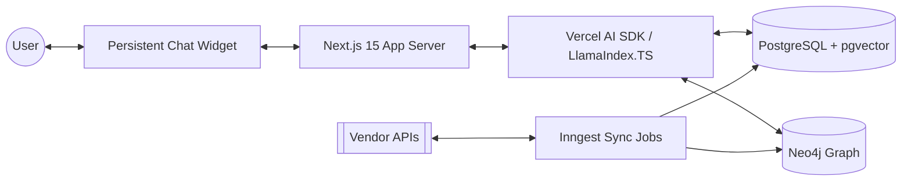

# Tech Stack & Architecture Decisions

## 1. Tech Stack Selection

| Component | Library / Service | Version | Rationale |
| :--- | :--- | :--- | :--- |
| **Frontend/Framework** | Next.js | 15 (App Router) | React Server Components, optimized streaming, and production stability. |
| **Language** | TypeScript | 5.x | Strict typing for complex AI workflows. |
| **Styling** | Tailwind CSS + shadcn/ui | latest | Rapid UI development with accessible components. |
| **AI Orchestration** | Vercel AI SDK | latest | Best-in-class support for streaming, tool calling, and multi-model support. |
| **Agentic Framework** | LlamaIndex.TS | latest | Specialized for RAG and data-to-LLM pipelines in TypeScript. |
| **ORM** | Drizzle ORM | latest | Lightweight, type-safe, and excellent `pgvector` support. |
| **Relational DB** | PostgreSQL | 16 (pgvector) | Standard for relational data + high-performance vector search. |
| **Graph DB** | Neo4j | 5.x | Native Property Graph for reasoning and complex preference modeling. |
| **Authentication** | Clerk | latest | Pre-built UI and simple multi-tenant/session management. |
| **Background Jobs** | Inngest | latest | Event-driven, reliable background processing for vendor sync. |

## 2. High-Level Architecture (Mermaid)



## 3. Monorepo Folder Structure Blueprint

```text
ai-product-platform/
├── apps/
│   └── web/                   # Next.js 15 application
│       ├── app/               # App Router pages
│       │   ├── api/           # API Routes (chat, ingestion)
│       │   └── layout.tsx     # Root layout with persistent widget
│       ├── components/        # UI components (chat, product cards)
│       ├── hooks/             # Custom hooks (useChat, usePreferences)
│       └── lib/               # Shared utilities
├── packages/
│   ├── ai/                    # Core AI logic (agents, tools, prompts)
│   ├── database/              # Drizzle schemas, migrations, Neo4j client
│   ├── config/                # Shared ESLint, Tailwind, TS configs
│   └── types/                 # Standardized TypeScript types/Zod schemas
├── scripts/                   # Migration and seed scripts
├── docker-compose.yml         # Local dev (Neo4j, Postgres)
├── package.json               # Workspace root
└── README.md
```

## 4. Architectural Guarantees
- **Type Safety**: End-to-end type safety from DB schema to Frontend using Drizzle and Zod.
- **Scalability**: Stateless API routes ready for Vercel deployment; async processing for heavy tasks via Inngest.
- **Extensibility**: Adapter pattern for vendors and modular agent tools allow for adding new capabilities without breaking core logic.
