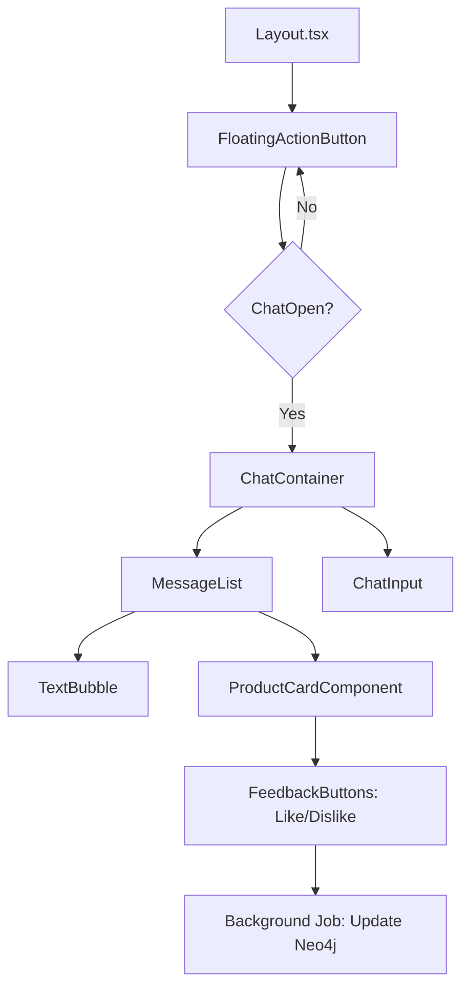

# Persistent Chat Flow Design

## 1. User Journey
The platform features a floating chat widget available on every page. This widget allows the user to interact with the AI recommendation agent at any point in their shopping journey.

1.  **Entry**: User clicks the floating chat icon (bottom-right).
2.  **Interaction**: User asks for advice (e.g., "I'm looking for a laptop for video editing under $2000").
3.  **Contextual Response**: Agent retrieves preferences from Neo4j + products from pgvector and responds.
4.  **Action**: Agent provides interactive product cards. User can "Like", "Dislike", or "View Details".
5.  **Persistence**: User navigates to a different page (e.g., "Cart" or "Settings"). The chat history and open/closed state remain intact.

## 2. Technical Flow

### 2.1 State Management
- **Persistence Across Pages**: Since this is a Next.js App Router application, the widget will be part of the root `layout.tsx`.
- **Client State**: Use `useChat` from Vercel AI SDK. To persist state across page refreshes, wrap the state in a `LocalStorage` or `Zustand` provider.
- **Server State**: Every message sent by the user is stored in the database (PostgreSQL/Neo4j) to enable long-term memory across sessions.

### 2.2 Message Lifecycle
1.  **Frontend**: User submits message via `useChat`.
2.  **API Route (`/api/chat`)**:
    - **Session Identification**: Use Clerk or NextAuth.js to identify the user.
    - **Preference Retrieval**: Call Neo4j to get the user's current preference sub-graph.
    - **Tool Calling (Vercel AI SDK)**:
        - `searchProducts`: Searches pgvector + reranks via Neo4j.
        - `updatePreferences`: Extracts new preferences from user message and updates Neo4j asynchronously.
    - **Streaming**: LLM generates a response (streaming text + UI components like product cards).
3.  **Real-time Graph Update**:
    - The `updatePreferences` tool identifies entities (Brands, Attributes) in the message.
    - It triggers a Neo4j `MERGE` query to update the graph.
    - Subsequent messages in the *same session* immediately benefit from the updated graph context.

### 2.3 Floating Widget UI (Mermaid Diagram)

## 3. Real-time Recommendations Trigger
The chat agent doesn't just wait for questions; it can "trigger" recommendations based on browsing behavior.
- **Trigger**: User views 3 different Sony laptops.
- **Action**: Chat widget pulses or shows a "Proactive Tip": *"I see you're looking at Sony laptops. Did you know the Model X has better battery life for your video editing needs?"*
- **Implementation**: The Next.js frontend sends "PageView" events to `/api/events`, which updates Neo4j. If a pattern is detected, the server sends a message to the client via WebSockets or Server-Sent Events (SSE).
