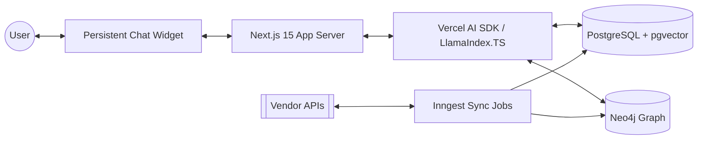

# Phase 1: Discovery & Planning - Project Migration & Enhancement

## 1. Codebase Audit Report
(Consolidated from Audit)

The original repository is a Python-based prototype using FastAPI, Streamlit, and LlamaIndex. It focuses on personalized product recommendations using vector search (pgvector) and a basic context retention system. The migration will transition this to a Next.js 15 App Router monorepo, replacing the Python stack with TypeScript and enhancing the data model with a Neo4j knowledge graph.

### Key Artifacts for Porting:
- **API logic** (FastAPI) -> Next.js API Routes / Server Actions.
- **Agent workflows** (LlamaIndex Python) -> LlamaIndex.TS / Vercel AI SDK.
- **Vector search** (psycopg2) -> Drizzle ORM + pgvector.
- **Context management** (SQLite) -> Neo4j Property Graph.

---

## 2. Knowledge Graph Schema Design

### Nodes & Relationships
- **Nodes**: User, PreferenceCategory, Brand, Vendor, ProductAttribute, Product.
- **Relationships**: PREFERS, DISLIKES, PURCHASED, SOLD_BY, HAS_ATTRIBUTE.

### Cypher Example: Multi-hop reasoning
```cypher
MATCH (u:User {id: $userId})-[:PREFERS]->(b:Brand)<-[:BELONGS_TO]-(p:Product)
MATCH (p)-[:HAS_ATTRIBUTE]->(a:ProductAttribute)<-[:PREFERS]-(u)
WHERE NOT (u)-[:DISLIKES]->(p)
RETURN p.id, p.name, count(a) as score
ORDER BY score DESC
LIMIT 10
```

---

## 3. Persistent Chat Flow Design

- **Floating Widget**: Part of the root `layout.tsx` in Next.js 15.
- **State Management**: `useChat` (Vercel AI SDK) + LocalStorage/Zustand for persistence.
- **Real-time Updates**: AI tools extract preferences from chat to update Neo4j asynchronously.
- **Proactive Recommendations**: SSE/WebSocket triggers based on browsing patterns stored in the graph.

---

## 4. Multi-Vendor Ingestion Strategy

- **Architecture**: Adapter pattern for multi-format APIs (JSON/XML/CSV).
- **Sync Jobs**: Inngest/Vercel Background Functions with Cron.
- **Ranking**: Hybrid scoring (40% Vector, 40% Graph, 20% Business logic).

---

## 5. Tech Stack & Architecture

- **Framework**: Next.js 15 (App Router).
- **AI**: Vercel AI SDK + LlamaIndex.TS.
- **DB**: PostgreSQL (Drizzle) + Neo4j (Graph).
- **Auth**: Clerk.
- **Jobs**: Inngest.



---

## 6. Project Setup Plan

1.  **Repo**: Next.js 15 monorepo with `pnpm` workspaces.
2.  **Local**: Docker Compose for Neo4j + Postgres (pgvector).
3.  **Timeline**: 2 weeks from Init to Handover.
4.  **Risks**: Graph complexity and LLM latency.

---

**=== SYSTEM TEST AND VALIDATION PLAN FOR PHASE 1 ===**

### Acceptance Criteria Checklist
- [ ] Codebase audit identifies all Python functions and models to be ported.
- [ ] Neo4j schema includes all required nodes (User, Brand, etc.) and relationships (PREFERS, etc.).
- [ ] Cypher queries for preference updates and multi-hop reasoning are syntactically correct and documented.
- [ ] Persistent chat architecture explains state retention across page transitions.
- [ ] Multi-vendor strategy includes an adapter pattern and background sync job details.
- [ ] Tech stack explicitly lists Next.js 15, Drizzle, and LlamaIndex.TS.
- [ ] Mermaid diagrams and folder structure follow production monorepo standards.

### Specific Validation Steps
1.  **Schema Linting**: Verify Neo4j constraints and indexes in the design document match the Cypher queries provided.
2.  **Flow Walkthrough**: Mentally trace a "Message -> Tool -> Graph Update -> Retrieval" cycle to ensure no data gaps.
3.  **Dependency Check**: Ensure all chosen libraries (Drizzle, Vercel AI SDK) are compatible with Next.js 15 and Node.js 20+.
4.  **Risk Audit**: Review the "Risks" section against the proposed architecture to ensure every risk has a corresponding mitigation strategy.

### Automated Checks
- **Schema Validation Script**: (To be run in Phase 2) A script that applies the Cypher constraints and verifies the database accepts the proposed schema.
- **Architecture Lint**: (To be run in Phase 2) Use `dependency-cruiser` to ensure the monorepo folder structure rules (e.g., `web` cannot import from `scripts`) are enforced.

### Sign-off Process
1.  **Lead Review**: Senior AI Engineer (Jules) reviews all design docs for production readiness.
2.  **Stakeholder Approval**: Client/User reviews the high-level architecture and timeline.
3.  **Phase Transition**: Upon approval, move to Phase 2: Core Infrastructure & Repository Setup.
